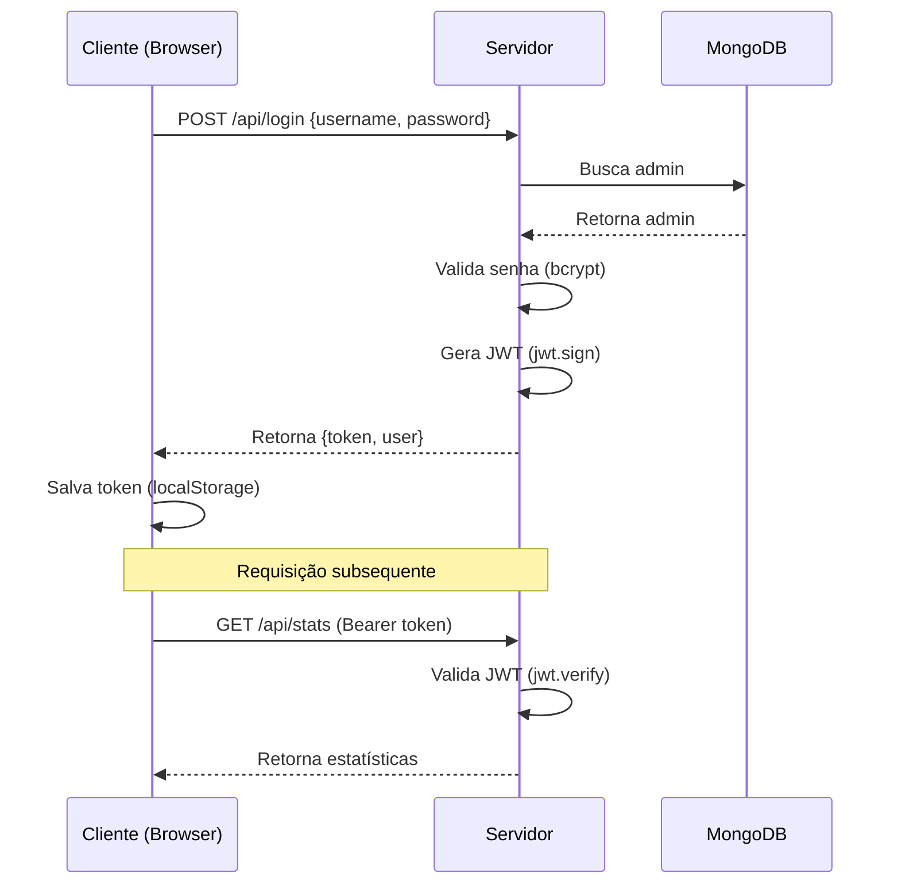
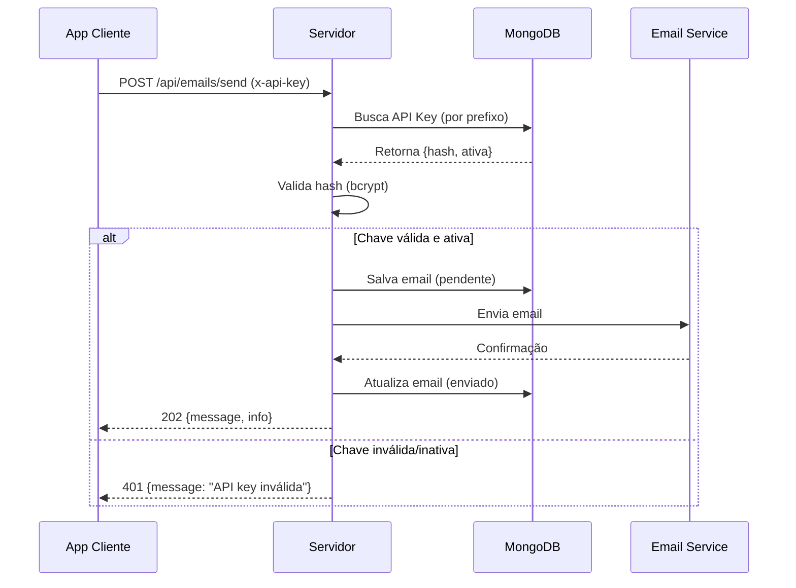
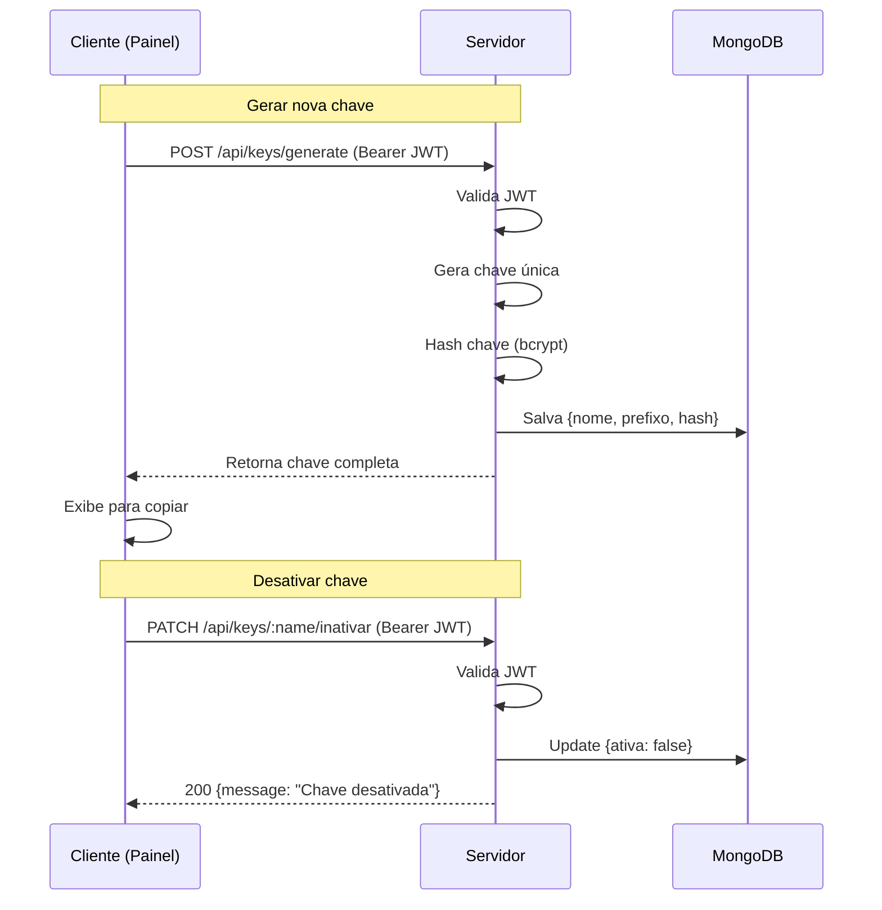

# 🔐 Guia de Autenticação - Mail Sender

Documentação completa sobre os sistemas de autenticação do Mail Sender.

---

## 📋 Índice

1. [Visão Geral](#-visão-geral)
2. [JWT (Painel Admin)](#-jwt-painel-administrativo)
3. [API Keys (Desenvolvedores)](#-api-keys-desenvolvedores)
4. [Middlewares](#️-middlewares)
5. [Fluxos de Autenticação](#-fluxos-de-autenticação)
6. [Segurança](#-segurança)
7. [Troubleshooting](#-troubleshooting)

---

## 🎯 Visão Geral

O Mail Sender utiliza **dois sistemas de autenticação independentes**:

| Tipo | Público-Alvo | Propósito | Validade | Header |
|------|--------------|-----------|----------|--------|
| **JWT** | Administradores | Gerenciar sistema | 8 horas | `Authorization: Bearer <token>` |
| **API Key** | Desenvolvedores | Enviar emails | Até revogação | `x-api-key: <key>` |

### Por que dois sistemas?

- **Separação de responsabilidades**: Admin gerencia, Dev consome
- **Segurança granular**: Diferentes níveis de acesso
- **Auditoria**: Rastreabilidade por tipo de ação
- **Flexibilidade**: Revogação independente

---

## 🔑 JWT (Painel Administrativo)

### Propósito

Autenticar **administradores humanos** para gerenciar o sistema através do painel web.

### Como Funciona

```
1. Admin faz login com username/password
        ↓
2. Servidor valida credenciais no MongoDB
        ↓
3. Servidor gera JWT assinado com JWT_SECRET
        ↓
4. JWT é retornado ao cliente
        ↓
5. Cliente armazena JWT (localStorage)
        ↓
6. Requisições incluem: Authorization: Bearer <JWT>
        ↓
7. Middleware valida JWT em cada requisição
```

### Endpoint de Login

**Request:**
```http
POST /api/login
Content-Type: application/json

{
  "username": "admin",
  "password": "SuaSenha123"
}
```

**Response (Sucesso):**
```json
{
  "success": true,
  "message": "Login bem sucedido!",
  "token": "eyJhbGciOiJIUzI1NiIsInR5cCI6IkpXVCJ9.eyJpZCI6IjY...",
  "user": {
    "id": "507f1f77bcf86cd799439011",
    "username": "admin",
    "email": "admin"
  }
}
```

**Response (Erro):**
```json
{
  "message": "Credenciais inválidas"
}
```

### Estrutura do JWT

**Header:**
```json
{
  "alg": "HS256",
  "typ": "JWT"
}
```

**Payload:**
```json
{
  "id": "507f1f77bcf86cd799439011",
  "username": "admin",
  "iat": 1730419200,
  "exp": 1730448000
}
```

**Signature:**
```
HMACSHA256(
  base64UrlEncode(header) + "." +
  base64UrlEncode(payload),
  JWT_SECRET
)
```

### Rotas Protegidas por JWT

| Método | Endpoint | Descrição |
|--------|----------|-----------|
| `GET` | `/api/stats` | Estatísticas gerais |
| `GET` | `/api/keys` | Listar todas as API Keys |
| `DELETE` | `/api/keys/:name` | Revogar API Key |
| `PATCH` | `/api/keys/:name/inativar` | Desativar API Key |
| `PATCH` | `/api/keys/:name/reativar` | Reativar API Key |
| `GET` | `/api/emails/recentes` | Listar emails recentes |

### Exemplo de Uso

**JavaScript (Fetch):**
```javascript
// 1. Fazer login
const loginResponse = await fetch('http://localhost:5015/api/login', {
  method: 'POST',
  headers: { 'Content-Type': 'application/json' },
  body: JSON.stringify({ username: 'admin', password: 'admin' })
});

const { token } = await loginResponse.json();

// 2. Salvar token
localStorage.setItem('jwt_token', token);

// 3. Usar token em requisições
const statsResponse = await fetch('http://localhost:5015/api/stats', {
  headers: { 'Authorization': `Bearer ${token}` }
});

const stats = await statsResponse.json();
console.log(stats);
```

**cURL:**
```bash
# 1. Login
TOKEN=$(curl -s -X POST http://localhost:5015/api/login \
  -H "Content-Type: application/json" \
  -d '{"username":"admin","password":"admin"}' \
  | jq -r '.token')

# 2. Usar token
curl http://localhost:5015/api/stats \
  -H "Authorization: Bearer $TOKEN"
```

### Configuração

**Variáveis de Ambiente:**
```env
JWT_SECRET=sua-chave-secreta-minimo-32-caracteres
ADMIN_USERNAME=admin
ADMIN_PASSWORD=SuaSenhaSegura123
```

**Gerar JWT_SECRET forte:**
```bash
# Node.js
node -e "console.log(require('crypto').randomBytes(48).toString('base64'))"

# Linux/Mac
openssl rand -base64 48

# PowerShell
[Convert]::ToBase64String((1..48 | ForEach-Object { Get-Random -Minimum 0 -Maximum 256 }))
```

---

## 🔐 API Keys (Desenvolvedores)

### Propósito

Autenticar **aplicações externas** para enviar emails programaticamente.

### Como Funciona

```
1. Admin gera API Key pelo painel
        ↓
2. Sistema cria chave única e retorna
        ↓
3. Hash da chave é armazenado no MongoDB
        ↓
4. Desenvolvedor copia a chave
        ↓
5. Dev adiciona chave no código/env
        ↓
6. Requisições incluem: x-api-key: <KEY>
        ↓
7. Middleware valida hash da chave
```

### Gerar API Key

**Request:**
```http
POST /api/keys/generate
Content-Type: application/json

{
  "name": "meu-app-producao"
}
```

**Response:**
```json
{
  "name": "meu-app-producao",
  "message": "Chave criada – salve em local seguro (não será mostrada de novo)",
  "apiKey": "mail_1234567890abcdef_ghijklmnopqrstuv1234567890abcd"
}
```

⚠️ **IMPORTANTE**: A chave completa **nunca** é armazenada no banco, apenas o hash bcrypt!

### Formato da API Key

```
mail_<prefixo-12-chars>_<chave-40-chars>
     └─ Identificador    └─ Chave secreta
```

**Exemplo:**
```
mail_a1b2c3d4e5f6_1234567890abcdefghijklmnopqrstuvwxyz1234
```

### Rotas Protegidas por API Key

| Método | Endpoint | Descrição |
|--------|----------|-----------|
| `POST` | `/api/emails/send` | Enviar email |
| `GET` | `/api/emails/meus` | Listar meus emails |

### Exemplo de Uso

**JavaScript (Node.js):**
```javascript
const axios = require('axios');

async function enviarEmail() {
  const response = await axios.post('http://localhost:5015/api/emails/send', {
    to: 'usuario@exemplo.com',
    subject: 'Bem-vindo!',
    template: 'bemvindo',
    data: {
      nomeSistema: 'Meu App',
      nome: 'João'
    }
  }, {
    headers: {
      'Content-Type': 'application/json',
      'x-api-key': process.env.MAIL_API_KEY
    }
  });

  console.log(response.data);
}
```

**cURL:**
```bash
curl -X POST http://localhost:5015/api/emails/send \
  -H "Content-Type: application/json" \
  -H "x-api-key: mail_a1b2c3d4e5f6_1234567890abcdefghij..." \
  -d '{
    "to": "usuario@exemplo.com",
    "subject": "Teste",
    "template": "bemvindo",
    "data": {
      "nomeSistema": "Meu App",
      "nome": "Maria"
    }
  }'
```

**Python:**
```python
import requests
import os

def enviar_email():
    url = 'http://localhost:5015/api/emails/send'
    headers = {
        'Content-Type': 'application/json',
        'x-api-key': os.environ['MAIL_API_KEY']
    }
    payload = {
        'to': 'usuario@exemplo.com',
        'subject': 'Bem-vindo!',
        'template': 'bemvindo',
        'data': {
            'nomeSistema': 'Meu App',
            'nome': 'Pedro'
        }
    }
    
    response = requests.post(url, json=payload, headers=headers)
    print(response.json())
```

### Gerenciamento de API Keys

**Listar (requer JWT):**
```bash
curl http://localhost:5015/api/keys \
  -H "Authorization: Bearer $JWT_TOKEN"
```

**Desativar (requer JWT):**
```bash
curl -X PATCH http://localhost:5015/api/keys/meu-app-producao/inativar \
  -H "Authorization: Bearer $JWT_TOKEN"
```

**Reativar (requer JWT):**
```bash
curl -X PATCH http://localhost:5015/api/keys/meu-app-producao/reativar \
  -H "Authorization: Bearer $JWT_TOKEN"
```

**Revogar (requer JWT):**
```bash
curl -X DELETE http://localhost:5015/api/keys/meu-app-producao \
  -H "Authorization: Bearer $JWT_TOKEN"
```

---

## 🛠️ Middlewares

### authMiddleware (JWT)

**Localização:** `src/middleware/authMiddleware.ts`

**Função:** Valida JWT em rotas administrativas

**Lógica:**
1. Extrai token do header `Authorization: Bearer <token>`
2. Verifica se token existe
3. Valida assinatura com `JWT_SECRET`
4. Verifica expiração
5. Anexa dados do usuário em `req.user`
6. Permite ou bloqueia requisição

**Código Simplificado:**
```typescript
export const authMiddleware = (req: Request, res: Response, next: NextFunction) => {
  const authHeader = req.headers.authorization;
  
  if (!authHeader || !authHeader.startsWith('Bearer ')) {
    return res.status(401).json({ message: 'Token não fornecido' });
  }

  const token = authHeader.substring(7);

  try {
    const decoded = jwt.verify(token, process.env.JWT_SECRET!);
    req.user = decoded; // Anexa dados do usuário
    next(); // Permite acesso
  } catch (error) {
    return res.status(401).json({ message: 'Token inválido ou expirado' });
  }
};
```

### apiKeyMiddleware (API Key)

**Localização:** `src/middleware/apiKeyMiddleware.ts`

**Função:** Valida API Key em rotas de envio de email

**Lógica:**
1. Extrai chave do header `x-api-key`
2. Verifica se chave existe
3. Busca chave no banco (por prefixo)
4. Compara hash com bcrypt
5. Verifica se está ativa
6. Anexa nome do usuário em `req.apiKeyUser`
7. Permite ou bloqueia requisição

**Código Simplificado:**
```typescript
export const apiKeyMiddleware = async (req: Request, res: Response, next: NextFunction) => {
  const apiKey = req.headers['x-api-key'] as string;
  
  if (!apiKey) {
    return res.status(401).json({ message: 'API key não fornecida' });
  }

  // Extrai prefixo (primeiros 17 caracteres: mail_xxxxxxxxxxxx)
  const prefixo = apiKey.substring(0, 17);
  
  // Busca no banco
  const keyData = await ApiKey.findOne({ prefixo });
  
  if (!keyData) {
    return res.status(401).json({ message: 'API key inválida' });
  }

  // Valida hash
  const isValid = await bcrypt.compare(apiKey, keyData.hash);
  
  if (!isValid || !keyData.ativa) {
    return res.status(401).json({ message: 'API key inválida ou inativa' });
  }

  req.apiKeyUser = keyData.nome; // Anexa nome
  next(); // Permite acesso
};
```

---

## 🔄 Fluxos de Autenticação

### Fluxo 1: Admin Acessando Painel



### Fluxo 2: Desenvolvedor Enviando Email



### Fluxo 3: Admin Gerenciando API Keys



---

## 🔒 Segurança

### Boas Práticas Implementadas

✅ **JWT:**
- Assinado com `HS256` (HMAC SHA-256)
- Expiração de 8 horas
- Secret forte (mínimo 32 caracteres)
- Validação em cada requisição

✅ **API Keys:**
- Hash bcrypt com 15 salt rounds
- Chave nunca armazenada em texto plano
- Prefixo para busca rápida
- Status ativa/inativa

✅ **Senhas:**
- Hash bcrypt antes de armazenar
- Validação de comprimento e tipo
- Sem senhas em logs

✅ **Middleware:**
- Validação rigorosa de headers
- Mensagens de erro genéricas (não expõe detalhes)
- Rate limiting recomendado

### Recomendações Adicionais

🔐 **Em Produção:**

1. **Use HTTPS obrigatoriamente**
   - JWT em HTTP é inseguro
   - Configure SSL/TLS

2. **Rotação de Secrets**
   ```bash
   # Gere novo JWT_SECRET periodicamente
   node -e "console.log(require('crypto').randomBytes(64).toString('base64'))"
   ```

3. **Rate Limiting**
   ```bash
   npm install express-rate-limit
   ```
   
   ```typescript
   import rateLimit from 'express-rate-limit';
   
   const loginLimiter = rateLimit({
     windowMs: 15 * 60 * 1000, // 15 minutos
     max: 5, // 5 tentativas
     message: 'Muitas tentativas. Tente novamente em 15 minutos.'
   });
   
   app.post('/api/login', loginLimiter, adminController.login);
   ```

4. **Monitore Falhas**
   ```typescript
   // Log tentativas de login falhadas
   if (loginFailed) {
     logger.warn(`Tentativa de login falha: ${username} - IP: ${req.ip}`);
   }
   ```

5. **Refresh Tokens**
   - Implemente refresh tokens para sessões longas
   - JWT curto (1h) + Refresh Token (7 dias)

6. **CORS Restritivo**
   ```typescript
   app.use(cors({
     origin: 'https://seu-frontend.com', // Específico!
     credentials: true
   }));
   ```

---

## 🆘 Troubleshooting

### JWT

**❌ "Token inválido ou expirado"**

**Causas:**
- Token realmente expirou (8h)
- `JWT_SECRET` mudou no servidor
- Token corrompido

**Soluções:**
```bash
# 1. Faça login novamente
# 2. Verifique JWT_SECRET
echo $JWT_SECRET

# 3. Debug token em jwt.io
# Cole o token e verifique payload
```

**❌ "Token não fornecido"**

**Causas:**
- Header `Authorization` faltando
- Formato incorreto do header

**Solução:**
```javascript
// ❌ Errado
headers: { 'Authorization': 'token-aqui' }

// ✅ Correto
headers: { 'Authorization': 'Bearer token-aqui' }
```

### API Key

**❌ "API key inválida"**

**Causas:**
- Chave incorreta ou incompleta
- Chave revogada
- Chave desativada

**Soluções:**
```bash
# 1. Verifique se a chave está completa (50+ caracteres)
echo $API_KEY | wc -c

# 2. Verifique status pelo painel
# Acesse: http://localhost:5015/painel → Aba API Keys

# 3. Gere nova chave se necessário
```

**❌ "API key não fornecida"**

**Causa:**
- Header `x-api-key` faltando

**Solução:**
```javascript
// ❌ Errado
headers: { 'api-key': 'mail_...' }

// ✅ Correto
headers: { 'x-api-key': 'mail_...' }
```

### Geral

**❌ "Cannot read properties of undefined"**

**Causa:**
- Variável de ambiente não carregada

**Solução:**
```bash
# Verifique se .env existe e está carregado
cat .env | grep JWT_SECRET
cat .env | grep DB_URL

# Reinicie o servidor
npm run dev
```

**❌ CORS Error**

**Causa:**
- Frontend em domínio diferente

**Solução:**
```typescript
// backend/src/api/api.ts
app.use(cors({
  origin: 'http://localhost:3000', // Adicione seu frontend
  credentials: true
}));
```

---

**Desenvolvido por [Ruan Lopes](https://github.com/RuanLopes1350)**
