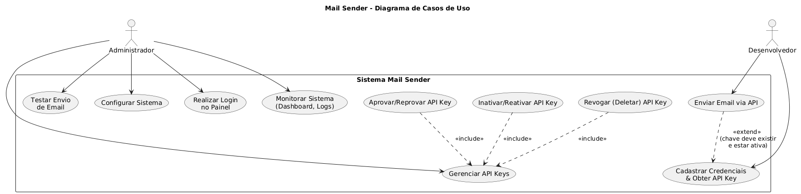
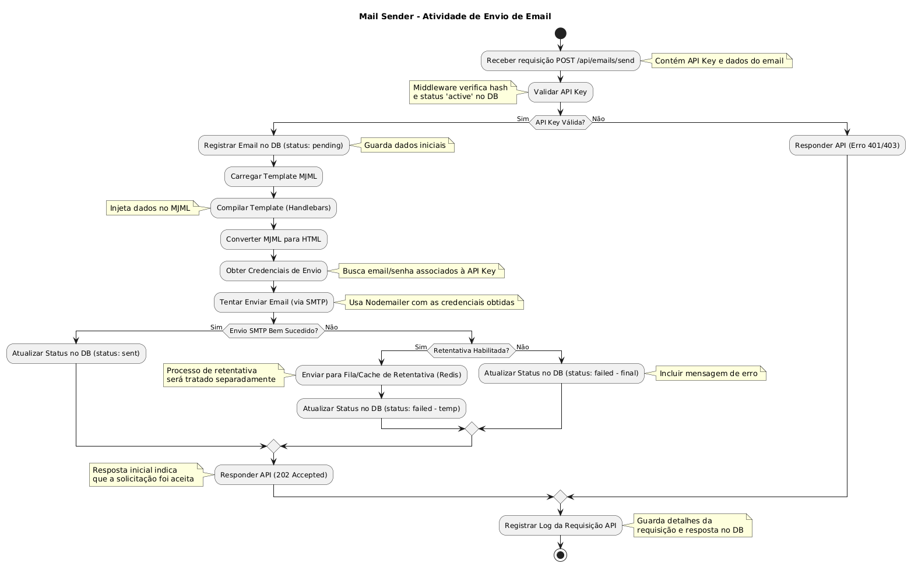
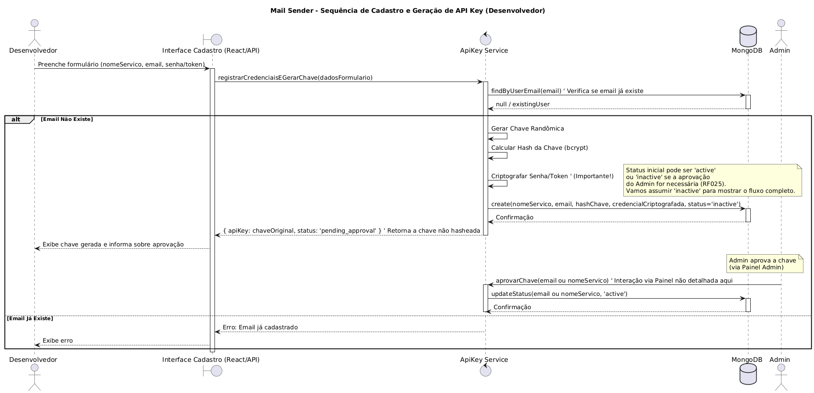
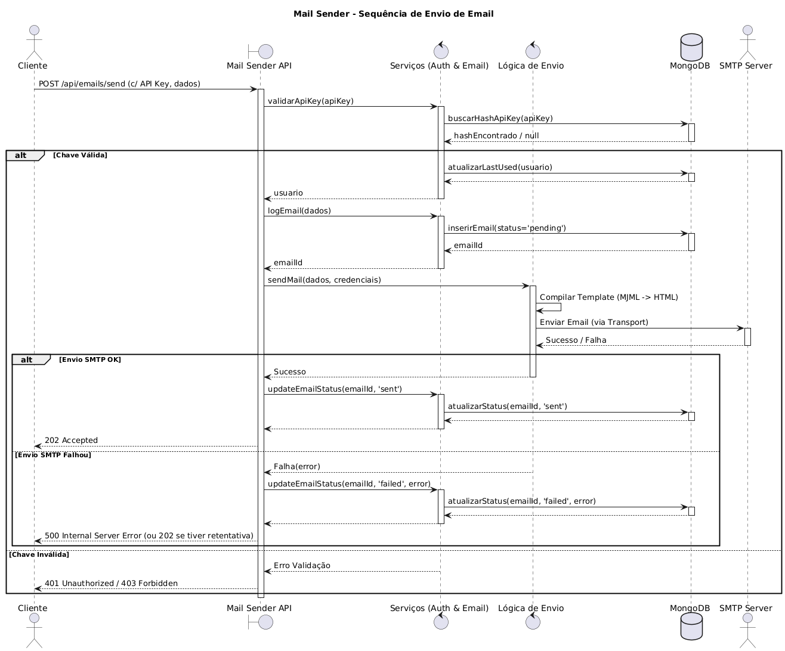
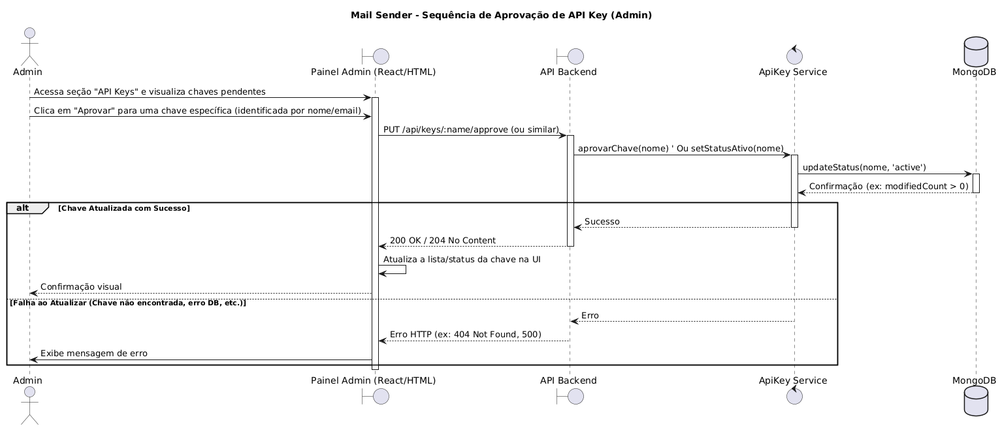
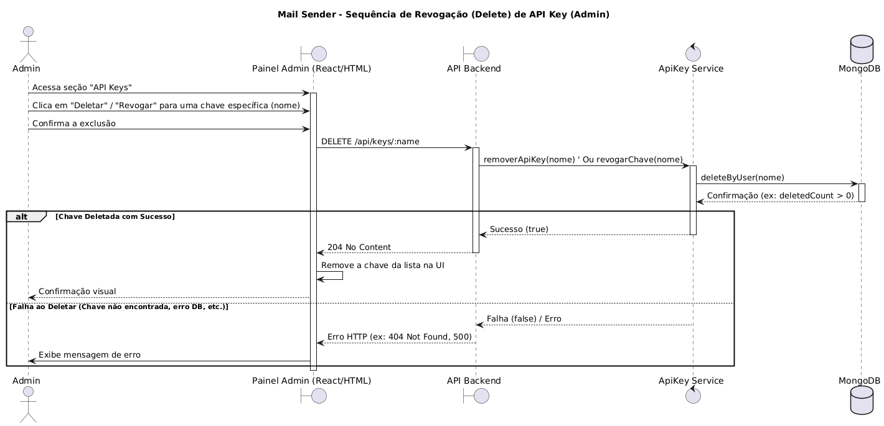
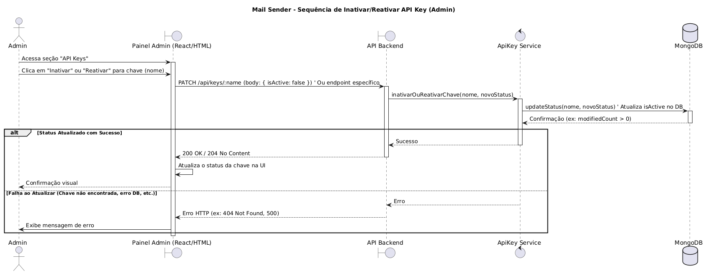

# **PROJETO DE SOFTWARE \- Mail Sender**

## ***Stakeholders***

| NOME | CARGO/PAPEL | E-MAIL/CONTATO |
| :---- | :---- | :---- |
| ########### | ########### | ########### |
| ########### | ########### | ########### |

# **Sumário**

* [RESUMO DO PROJETO](#resumo-do-projeto)  
* [INTRODUÇÃO](#introdução)  
  * [PROPÓSITO DESTE DOCUMENTO](#propósito-deste-documento)  
  * [CONCEPÇÃO DO SISTEMA](#concepção-do-sistema)  
* [DESCRIÇÃO GERAL](#descrição-geral)  
  * [USUÁRIOS DO SISTEMA (ATORES)](#usuários-do-sistema-atores)  
  * [ABRANGÊNCIA E SISTEMAS SIMILARES](#abrangência-e-sistemas-similares)  
  * [SUPOSIÇÕES E DEPENDÊNCIAS](#suposições-e-dependências)  
* [REQUISITOS DO SOFTWARE](#requisitos-do-software)  
  * [REQUISITOS FUNCIONAIS](#requisitos-funcionais)  
  * [REQUISITOS NÃO FUNCIONAIS](#requisitos-não-funcionais)  
* [PROTOTIPAGEM](#prototipagem)  
* [DIAGRAMA DE CASOS DE USO](#diagrama-de-casos-de-uso)  
  * [DESCRIÇÃO TEXTUAL DOS CASOS DE USO](#descrição-textual-dos-casos-de-uso)  
  * [ESPECIFICAÇÃO DOS CASOS DE USO](#especificação-dos-casos-de-uso)  
* [DIAGRAMA DE CLASSES](#diagrama-de-classes)  
* [DIAGRAMA DE SEQUÊNCIAS](#diagrama-de-sequências)  
* [DIAGRAMA DE ATIVIDADES](#diagrama-de-atividades)

# **RESUMO DO PROJETO**

|  |  |
| :---- | :---- |
| **NOME** | Mail Sender |
| **Líder do Projeto** | Ruan Lopes |
| **PRINCIPAL OBJETIVO** | Fornecer um microserviço robusto e gerenciável para o envio de emails transacionais e informativos, com templates personalizáveis e autenticação segura, para uso por diversas aplicações e instituições. |
| **BENEFÍCIOS ESPERADOS** | Simplificar o envio de emails para desenvolvedores, padronizar a comunicação visual com templates MJML, centralizar o gerenciamento de credenciais e API Keys, e facilitar o monitoramento via painel. |
| **INÍCIO E TÉRMINO PREVISTOS** | (Projeto contínuo, iniciado em 01/06/2025, com novas funcionalidades sendo adicionadas.) |

# **INTRODUÇÃO**

Eu desenvolvi o Mail Sender como um microserviço para facilitar o envio de emails transacionais e informativos a partir de outras aplicações. Minha intenção foi criar uma ferramenta com uma API RESTful segura, gerenciamento de credenciais de envio, templates personalizáveis usando MJML, e um painel administrativo para monitorar e gerenciar API Keys e os envios. Pensei neste sistema para ser hospedado por instituições (como o IF onde estudo) ou empresas para uso interno, ou mesmo por desenvolvedores individuais (como eu) para seus próprios projetos, permitindo um controle centralizado e seguro sobre o envio de emails.

## **PROPÓSITO DESTE DOCUMENTO**

O objetivo deste documento é detalhar a concepção, arquitetura, requisitos e funcionalidades do meu sistema Mail Sender. Ele serve como um guia para o desenvolvimento contínuo, manutenção e para que outros possam entender o software, garantindo que as informações relevantes estejam organizadas e acessíveis.

## **CONCEPÇÃO DO SISTEMA**

A ideia do sistema surgiu da minha percepção da necessidade, tanto no ambiente acadêmico (IFRO - Vilhena) quanto no mercado, de uma solução centralizada e padronizada para envio de emails por diferentes projetos. Quis oferecer uma alternativa gerenciável e segura, usando tecnologias com as quais tenho afinidade: Node.js, TypeScript e MongoDB. Os requisitos foram definidos com base no que já implementei, nos meus planos para evoluir o sistema e na análise das necessidades que observei em potenciais usuários.

# **DESCRIÇÃO GERAL**

O Mail Sender funciona como um gateway de envio de emails. As aplicações cliente se autenticam usando uma API Key e enviam requisições para a API REST do Mail Sender, informando o destinatário, assunto, o template que querem usar e os dados para preenchê-lo. Meu sistema processa essa requisição, compila o template MJML correspondente com os dados, gera o HTML final e o envia usando o provedor de email configurado (comecei com Gmail, mas planejo suportar outros). O sistema também conta com um painel administrativo web onde o gestor da instância pode gerenciar as API Keys, fazer testes de envio e monitorar a atividade e as estatísticas.

## **USUÁRIOS DO SISTEMA (ATORES)**

| ATOR | DESCRIÇÃO |
| :---- | :---- |
| Administrador | É quem gerencia a instância do Mail Sender. Ele gerencia as API Keys (cria, lista, revoga, aprova/inativa), monitora o sistema pelo painel, realiza testes, configura opções e se autentica no painel. |
| Desenvolvedor | Representa a aplicação que usa a API. Utiliza a API Key para autenticar suas requisições de envio de email. Ele também poderá cadastrar suas próprias credenciais de envio e obter uma API Key associada. |

## **ABRANGÊNCIA E SISTEMAS SIMILARES**

Minha intenção com o Mail Sender é fornecer uma solução *self-hosted* ou hospedada internamente para gerenciar o envio de emails transacionais. Ele se diferencia de serviços como SendGrid, Mailgun ou AWS SES porque é uma aplicação que a própria organização pode hospedar e controlar, integrando-se com provedores SMTP que ela já utilize (como Gmail, por enquanto).  
Existem plataformas de envio de email similares (SendGrid, Mailgun, AWS SES, Postmark), mas o Mail Sender busca ser uma solução mais controlada, de código aberto (licença ISC), com foco em templates MJML e um painel integrado para gerenciamento de chaves e monitoramento, o que pode ser interessante para quem prefere manter mais controle sobre essa parte da infraestrutura ou busca algo mais simples e direto.

## **SUPOSIÇÕES E DEPENDÊNCIAS**

* **Suposições:**  
  * O ambiente onde o Mail Sender será hospedado tem Node.js (v18+) instalado.  
  * Há acesso a um servidor MongoDB (local ou na nuvem).  
  * Uma conta de email (inicialmente Gmail com App Password) está disponível para ser o remetente.  
  * Os Administradores e Desenvolvedores têm conhecimento técnico básico para configurar e usar o sistema/API.  
  * A rede permite conexões SMTP para o provedor de email configurado.  
* **Dependências:**  
  * **Node.js (v18+):** Plataforma de execução.  
  * **MongoDB:** Banco de dados para API Keys e logs.  
  * **Provedor SMTP:** Serviço de email (ex: Gmail).  
  * **Navegador Web:** Para o Painel Administrativo.  
  * **Conectividade de Rede:** Para API, DB e SMTP.  
  * **Redis:** (Opcional) Para cache de emails com falha.  
  * **RabbitMQ:** (Opcional) Para enfileiramento.

# **ESTUDO DE VIABILIDADE**

* **Viabilidade Técnica:**  
  * As tecnologias que escolhi (Node.js, TypeScript, Express, MJML, MongoDB, React) são maduras e amplamente utilizadas, com bom suporte da comunidade.  
  * A integração com SMTP (via Nodemailer) é padrão.  
  * A criação de APIs RESTful com Express é consolidada.  
  * A compilação de MJML é feita pela biblioteca oficial.  
  * **Conclusão:** Tecnicamente, o projeto é viável.  
* **Viabilidade Econômica:**  
  * **Custos de Desenvolvimento:** Meu tempo como desenvolvedor principal.  
  * **Custos de Infraestrutura:** Variam conforme a hospedagem. Pode ser baixo (self-hosted, Docker, Mongo Atlas gratuito) ou aumentar com serviços pagos (Redis/RabbitMQ Cloud).  
  * **Custos Operacionais:** Custo do provedor de email (Gmail tem limites gratuitos).  
  * **Conclusão:** É economicamente viável, principalmente para uso interno ou com hospedagem de baixo custo.  
* **Viabilidade Operacional:**  
  * Requer um Administrador com conhecimento técnico para instalação, configuração e gerenciamento.  
  * A manutenção envolve atualizações e monitoramento.  
  * **Conclusão:** É operacionalmente viável com a administração técnica adequada.  
* **Viabilidade Legal:**  
  * Utiliza bibliotecas com licenças permissivas (ISC, MIT, Apache).  
  * É preciso respeitar os termos de uso do provedor SMTP (ex: limites do Gmail).  
  * Atenção à LGPD dependendo do conteúdo dos emails.  
  * **Conclusão:** Legalmente viável, respeitando as políticas de terceiros e leis aplicáveis.

# **METODOLOGIA ADOTADA NO DESENVOLVIMENTO**

Para o desenvolvimento inicial, adotei uma abordagem iterativa, focando em entregar as funcionalidades básicas primeiro. Para as próximas etapas, pretendo usar o **Kanban**, pois me dá flexibilidade como desenvolvedor individual:

* **Visualização:** Usarei um quadro (provavelmente GitHub Projects) com colunas como Backlog, A Fazer, Em Andamento, Teste, Concluído.  
* **Limitar WIP:** Definirei um limite de tarefas "Em Andamento" para manter o foco.  
* **Gerenciar Fluxo:** Priorizarei as tarefas do backlog.  
* **Melhoria Contínua:** Revisarei o processo periodicamente.

# **REQUISITOS DO SOFTWARE**

Aqui estão os requisitos funcionais e não funcionais que definem o que o Mail Sender faz e como ele deve operar.

## **REQUISITOS FUNCIONAIS**

| ID | NOME | DESCRIÇÃO | PRIORIDADE |
| :---- | :---- | :---- | :---- |
| RF001 | Expor API RESTful | O sistema deve expor uma API RESTful para suas funcionalidades principais (envio, gerenciamento de chaves, status). | Alta |
| RF002 | Suporte a Templates MJML | O sistema deve utilizar templates escritos em MJML para formatar os emails, garantindo responsividade. | Alta |
| RF003 | Templates Base | O sistema deve fornecer, no mínimo, os templates bemvindo e generico. | Alta |
| RF004 | Injeção de Dados em Templates | O sistema deve permitir a passagem de dados dinâmicos (JSON) via API para preencher variáveis nos templates MJML (usando Handlebars). | Alta |
| RF005 | Persistência de Logs de Email | O sistema deve registrar informações sobre cada tentativa de envio de email (destinatário, assunto, template, status, data, erro se houver) no MongoDB. | Alta |
| RF006 | Persistência de Logs de Requisição | O sistema deve registrar informações sobre cada requisição recebida pela API (endpoint, método, status HTTP, IP, user-agent, tempo de resposta, data) no MongoDB. | Média |
| RF007 | Login no Painel Admin | O sistema deve implementar um mecanismo de autenticação (ex: OAuth, usuário/senha) para acesso ao Painel Administrativo. | Alta |
| RF008 | Acesso Restrito ao Painel | Apenas usuários autenticados como Administrador devem conseguir acessar as funcionalidades do Painel Administrativo. | Alta |
| RF010 | Cadastro de Credenciais (Dev) | O sistema deve permitir que Desenvolvedores cadastrem suas próprias credenciais de envio (email remetente, senha/token, provedor SMTP/API). | Alta |
| RF011 | Associação Credencial-API Key | Ao gerar/cadastrar uma API Key (via RF010), o sistema deve associá-la às credenciais de envio fornecidas pelo Desenvolvedor. | Alta |
| RF012 | Armazenamento Seguro Credenciais | As senhas/tokens de envio dos Desenvolvedores devem ser armazenadas de forma segura (criptografada) no MongoDB. | Alta |
| RF013 | Interface de Cadastro (Dev) | O sistema deve fornecer uma interface (ex: parte do frontend React) para o Desenvolvedor realizar o cadastro de credenciais (RF010). | Média |
| RF014 | Autenticação por API Key (Envio) | O endpoint de envio de email (/api/emails/send) deve exigir uma API Key válida no header x-api-key. | Alta |
| RF015 | Validação de API Key | O sistema deve validar a API Key recebida comparando seu hash (bcrypt) com os hashes armazenados no MongoDB e verificando se está ativa. | Alta |
| RF016 | Tratamento de API Key Inválida | Requisições de envio com API Key inválida, inativa ou ausente devem retornar um erro HTTP apropriado (401 ou 403\) e não proceder com o envio. | Alta |
| RF017 | Armazenamento Seguro de API Key | O sistema deve armazenar as API Keys no MongoDB utilizando hash bcrypt com salt adequado. | Alta |
| RF020 | Geração de API Key (Admin) | O Administrador deve poder gerar uma nova API Key associada a um nome/identificador. A chave completa deve ser exibida apenas no momento da criação. | Alta |
| RF021 | Listagem de API Keys (Admin) | O Administrador deve poder listar todas as API Keys (ativas e inativas), exibindo nome, status, prefixo da chave (hash), data de criação e data do último uso. | Alta |
| RF022 | Revogação de API Key (Admin) | O Administrador deve poder revogar (deletar permanentemente) uma API Key existente através do seu nome/identificador. | Alta |
| RF023 | Registro de Uso de API Key | O sistema deve atualizar a data/hora do último uso de uma API Key sempre que ela for validada com sucesso em uma requisição. | Média |
| RF024 | Configuração de Aprovação | O Administrador deve poder configurar se novas API Keys (cadastradas via RF013) requerem aprovação manual. | Média |
| RF025 | Fluxo de Aprovação de Chaves | Se a aprovação for necessária (RF024), novas chaves (RF013) devem iniciar como inactive e só serem ativadas pelo Administrador no painel. | Média |
| RF026 | Inativar/Reativar Chave (Admin) | O Administrador deve poder marcar uma API Key como inactive ou active através do painel, sem excluí-la. | Média |
| RF030 | Recebimento de Solicitação de Envio | O sistema deve aceitar requisições POST em /api/emails/send com to, subject, template e data no corpo JSON. | Alta |
| RF031 | Carregamento de Template | O sistema deve localizar e carregar o arquivo .mjml correspondente ao template solicitado. | Alta |
| RF032 | Compilação de Template (Handlebars) | O sistema deve processar o template MJML com os data fornecidos usando Handlebars. | Alta |
| RF033 | Conversão MJML para HTML | O sistema deve converter o MJML processado para HTML compatível com clientes de email. | Alta |
| RF034 | Envio com Credenciais Dinâmicas | O sistema deve usar as credenciais de envio (email, senha/token) associadas à API Key da requisição para enviar o email via SMTP (ex: Gmail, Sendgrid). | Alta |
| RF035 | Registro Inicial do Email (Pending) | Antes de tentar o envio, o sistema deve registrar o email no MongoDB com status pending. | Alta |
| RF036 | Atualização de Status Pós-Envio | Após a tentativa de envio SMTP, o sistema deve atualizar o status do registro do email no MongoDB para sent (sucesso) ou failed (falha), incluindo a msg de erro. | Alta |
| RF037 | Resposta da API (Sucesso Envio) | A API /api/emails/send deve retornar status 202 Accepted em caso de sucesso no início do processo de envio (ou enfileiramento). | Alta |
| RF038 | Resposta da API (Erro Envio) | A API /api/emails/send deve retornar status 5xx em caso de falha no processamento inicial ou 4xx para erros de validação de dados. | Alta |
| RF040 | Interface Web (Painel Admin) | O sistema deve fornecer uma interface web (Painel Administrativo) acessível via navegador. | Alta |
| RF041 | Dashboard de Estatísticas | O painel deve exibir um Dashboard com estatísticas agregadas (total de emails, sucesso, falha, total de requisições API). | Alta |
| RF042 | Listagem de Emails Recentes (Painel) | O painel deve exibir uma lista/tabela dos emails enviados mais recentemente com seus detalhes (data, para, assunto, template, status). | Alta |
| RF043 | Gerenciamento de API Keys (Painel) | O painel deve permitir ao Administrador gerar, listar, revogar, inativar/reativar e aprovar API Keys. | Alta |
| RF044 | Teste de Envio de Email (Painel) | O painel deve fornecer uma funcionalidade para o Administrador testar o envio de emails, especificando todos os parâmetros necessários (incluindo API Key). | Alta |
| RF045 | Logs de Atividade Recente (Painel) | O painel deve exibir uma lista/tabela das requisições mais recentes à API com seus detalhes (data, método, endpoint, status, usuário). | Média |
| RF050 | Cache de Falhas (Redis) | Emails que falharem no envio (ex: erro SMTP temporário) devem ser armazenados no Redis para retentativa. | Média |
| RF051 | Mecanismo de Retentativas | O sistema deve implementar lógica para reenviar emails do Redis (ex: 3 tentativas, intervalo de 1 min). | Média |
| RF052 | Tratamento de Falha Definitiva | Após esgotar as retentativas (RF051), o email deve ser removido do Redis e seu status final failed registrado no MongoDB. | Média |
| RF060 | Enfileiramento (RabbitMQ) | (Opcional) A API /api/emails/send deve publicar a solicitação em uma fila RabbitMQ e retornar 202\. | Baixa |
| RF061 | Worker de Envio (RabbitMQ) | (Opcional) Um serviço/worker separado deve consumir a fila RabbitMQ e realizar o processo de envio (RF031 a RF036, RF050-RF052). | Baixa |
| RF070 | Rate Limiting por API Key | O sistema deve limitar o número de requisições ao endpoint /api/emails/send por API Key em um determinado intervalo de tempo. | Média |
| RF071 | Resposta de Rate Limit Excedido | Requisições que excederem o limite (RF070) devem receber uma resposta HTTP 429 Too Many Requests. | Média |
| RF080 | Frontend React | O Painel Administrativo (public/) deve ser reimplementado utilizando a biblioteca React e TailwindCSS. | Alta |

## **REQUISITOS NÃO FUNCIONAIS**

| ID | NOME | DESCRIÇÃO | PRIORIDADE |
| :---- | :---- | :---- | :---- |
| RNF001 | Performance API | A API /api/emails/send deve responder em \< 500ms (média). | Alta |
| RNF002 | Performance Envio | O tempo médio entre a requisição API e a entrega ao SMTP do destinatário deve ser \< 10 segundos (para envios diretos, sem fila). | Alta |
| RNF010 | Escalabilidade | A arquitetura deve permitir escalonamento horizontal para lidar com aumento de carga (ex: centenas de emails/dia), dependendo da hospedagem. | Média |
| RNF020 | Confiabilidade | Emails aceitos pela API devem ser enviados ou marcados como falha definitiva (considerando retentativas). O sistema deve buscar alta disponibilidade (uptime). | Alta |
| RNF021 | Resiliência | O sistema deve lidar com falhas temporárias de conexão (DB, SMTP, Redis), registrando erros e tentando reconectar/reenviar quando aplicável. | Média |
| RNF030 | Segurança Chaves | API Keys devem ser armazenadas com hash bcrypt seguro. | Alta |
| RNF031 | Segurança Creds | Credenciais de envio dos usuários devem ser criptografadas no banco. | Alta |
| RNF032 | Segurança Painel | Acesso ao Painel Admin deve ser protegido por autenticação segura. | Alta |
| RNF033 | Segurança Geral | Entradas de API e painel devem ser validadas/sanitizadas. Comunicação via HTTPS é fortemente recomendada. | Alta |
| RNF040 | Usabilidade API | A API deve ser bem documentada (ex: Swagger/Scalar), intuitiva e fácil de integrar. | Alta |
| RNF041 | Usabilidade Painel | O Painel Admin deve ser intuitivo, responsivo e fornecer informações claras. | Alta |
| RNF050 | Manutenibilidade | O código deve ser modular, comentado, seguir padrões (TypeScript/Node.js) e ter baixo acoplamento. | Alta |
| RNF051 | Observabilidade | O sistema deve gerar logs detalhados e estruturados para diagnóstico (usando níveis como info, warn, error). | Média |
| RNF052 | Configurabilidade | Configurações críticas (porta, URIs, credenciais master) devem ser gerenciadas via variáveis de ambiente. | Alta |
| RNF060 | Implantação | O sistema deve ser facilmente implantável localmente (dev) e via Docker/Kubernetes. | Alta |

# **PROTOTIPAGEM**

Atualmente, o Painel Administrativo na pasta public/ (feito com HTML, CSS e JS) funciona como um protótipo funcional. Ele demonstra as funcionalidades de dashboard, gerenciamento de chaves e teste de envio.  
Planejo refazer completamente essa interface usando React e TailwindCSS (RF080) para melhorar a experiência do usuário, a aparência visual e facilitar a manutenção e adição de novas funcionalidades.  
*(Imagens do protótipo removidas, conforme solicitado)*

# **DIAGRAMA DE CASOS DE USO**

## **DESCRIÇÃO TEXTUAL DOS CASOS DE USO**

* **Desenvolvedor:**  
  * Enviar Email: Usa a API /api/emails/send com sua API Key para enviar um email.  
  * Cadastrar Credenciais/Gerar API Key: Usa uma interface/endpoint para registrar suas credenciais de email e obter uma API Key.  
* **Administrador:**  
  * Gerenciar API Keys: Usa o Painel (ou API /api/keys/\*) para criar, listar, revogar, aprovar/reprovar, inativar/reativar chaves.  
  * Monitorar Sistema: Acessa o Painel para ver estatísticas, emails recentes e logs.  
  * Testar Envio de Email: Usa a funcionalidade do Painel para enviar emails de teste.  
  * Realizar Login: Autentica-se para acessar o Painel.  
  * Configurar Sistema: Ajusta configurações globais (ex: modo de aprovação).

## **ESPECIFICAÇÃO DOS CASOS DE USO**

### **UC-01 \- Enviar Email**

| UC-01 \- Enviar Email |  |
| :---- | :---- |
| **Descrição/Objetivo:** | Permitir que minha aplicação cliente envie um email através da API do Mail Sender. |
| **Ator:** | Desenvolvedor (Aplicação Cliente) |
| **Pré-condições:** | Possuo uma API Key válida e ativa. O serviço Mail Sender está rodando. O template existe. |
| **Pós-condições:** | O email é processado, registrado e enviado (ou enfileirado). A API retorna 202 ou um erro. |
| **FLUXO PRINCIPAL / BÁSICO:** | 1\. Minha aplicação envia POST para /api/emails/send. 2\. Inclui header x-api-key e JSON com to, subject, template, data. 3\. O Middleware valida a API Key (RF015). 4\. O sistema registra o email no DB (pending) (RF035). 5\. O sistema carrega o template MJML (RF031). 6\. O sistema compila com Handlebars (RF032). 7\. O sistema converte para HTML (RF033). 8\. O sistema envia via SMTP usando as credenciais da chave (RF034). 9\. O sistema atualiza o status no DB (sent/failed) (RF036). 10\. O sistema retorna a resposta (202/5xx) (RF037/RF038). |
| **FLUXOS ALTERNATIVOS / EXCEÇÕES:** | A1: API Key inválida/inativa/ausente: Retorna 401/403 (RF016). A2: Template não encontrado: Retorna 500 (RF038). A3: Erro compilação/conversão: Retorna 500 (RF038). A4: Falha SMTP: Atualiza status para failed (RF036) e retorna 500 (ou 202 se houver retentativa RF050). |

### **UC-02 \- Gerenciar API Keys (Admin)**

| UC-02 \- Gerenciar API Keys (Admin) |  |
| :---- | :---- |
| **Descrição/Objetivo:** | Permitir que eu, como Administrador, crie, visualize, remova e gerencie o status das API Keys pelo Painel. |
| **Ator:** | Administrador |
| **Pré-condições:** | Estou logado no Painel Administrativo. |
| **Pós-condições:** | A lista de API Keys é atualizada. |
| **FLUXO (Gerar):** | 1\. Acesso "API Keys". 2\. Informo um nome. 3\. Clico "Gerar Chave". 4\. O sistema gera a chave/hash (RF020), salva no DB (RF017). 5\. O sistema me mostra a chave completa (só agora). 6\. A lista é atualizada (RF021). |
| **FLUXO (Listar):** | 1\. Acesso "API Keys". 2\. O sistema busca e exibe as chaves (RF021). |
| **FLUXO (Revogar):** | 1\. Acesso "API Keys". 2\. Localizo a chave. 3\. Clico "Revogar/Deletar". 4\. Confirmo. 5\. O sistema remove do DB (RF022). 6\. A lista é atualizada. |
| **FLUXO (Inativar/Reativar):** | 1\. Acesso "API Keys". 2\. Localizo a chave. 3\. Clico "Inativar" ou "Reativar". 4\. O sistema atualiza o status isActive no DB (RF026). 5\. A lista é atualizada. |
| **FLUXO (Aprovar/Reprovar):** | 1\. Acesso "API Keys". 2\. Localizo chave inactive pendente. 3\. Clico "Aprovar" (muda para active) ou "Reprovar" (remove ou marca como reprovada) (RF025). 4\. A lista é atualizada. |
| **FLUXOS ALTERNATIVOS:** | A1: Nome duplicado (Gerar): Erro. A2: Erro DB: Erro. A3: Chave não encontrada: Erro/sem efeito. |

### **UC-03 \- Monitorar Sistema (Admin)**

| UC-03 \- Monitorar Sistema (Admin) |  |
| :---- | :---- |
| **Descrição/Objetivo:** | Permitir que eu, como Administrador, veja o estado do sistema, estatísticas e atividades recentes no Painel. |
| **Ator:** | Administrador |
| **Pré-condições:** | Estou logado no Painel. O sistema está rodando e coletando dados. |
| **Pós-condições:** | Tenho uma visão atualizada do sistema. |
| **FLUXO PRINCIPAL / BÁSICO:** | 1\. Acesso o Painel. 2\. O frontend pede dados para /api/stats. 3\. A API busca os dados no MongoDB (RF005, RF006). 4\. A API retorna os dados. 5\. O painel exibe as estatísticas (RF041), emails recentes (RF042) e logs de atividade (RF045). 6\. O painel pode atualizar os dados automaticamente. |
| **FLUXOS ALTERNATIVOS / EXCEÇÕES:** | A1: Erro ao buscar dados: API retorna 500, painel mostra erro. A2: API indisponível: Painel mostra erro de conexão. |

# **DIAGRAMA DE CLASSES**

# **DIAGRAMA DE SEQUÊNCIAS**

# **DIAGRAMA DE ATIVIDADES**

